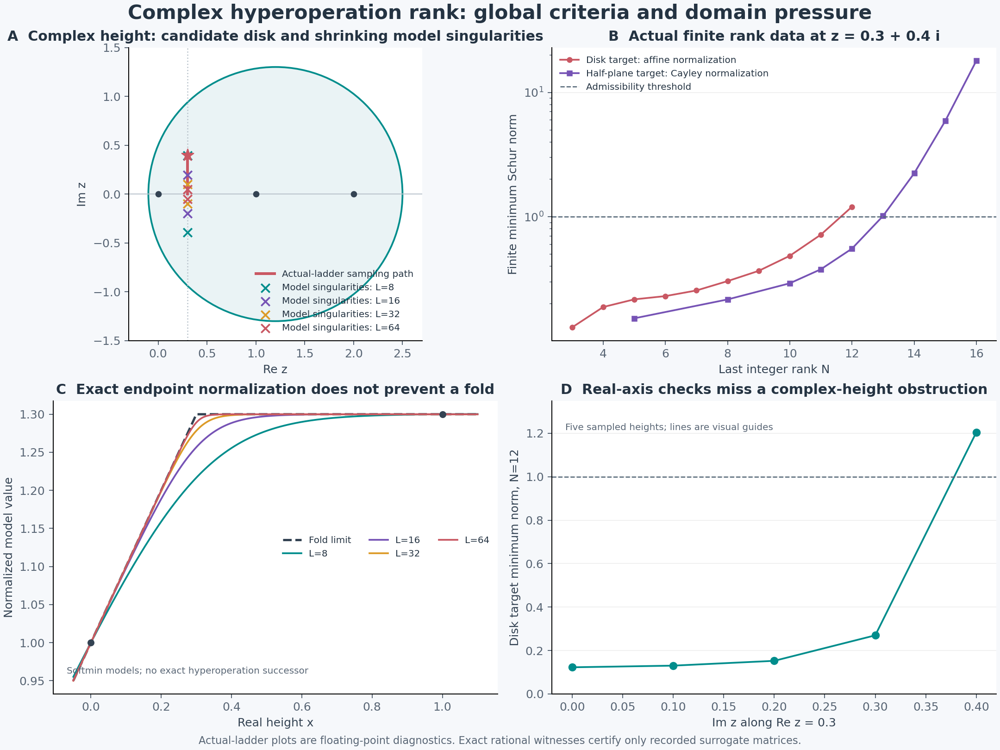

# R010　半平面值层级、自动后继与共同复域的诊断

日期：2026-10-05。状态：半平面自映射类的完整条件构造定理、零高度的局部延拓判据，以及缩短周期/折角极限的共同域障碍。真实第3至12层的复高度 Pick 失败为高精度诊断；精确有理负方向只认证记录的有限小数数据。**实际阶梯的全局构造及实际函数值的区间认证均未完成。**

## 1. 为什么进一步放宽 R009 的高度圆盘

R009 要求全部整数层与连续候选自映射一个固定有界高度圆盘。这既保证复合有定义，又保证后继残差有界。然而实际链未证明满足这个要求，而且第4节出现有限复高度的失败诊断。

本节改用无界高度半平面 `U={Re z>0}`，层级域仍是 `H_σ={Re r>σ},σ<3`。要求整数层 `S_n:U→U,n≥3` 全纯，保持 `S_n(1)=a>0`，且

\[
S_n(z+1)=S_{n-1}(S_n(z)),\qquad n\ge4,\ z\in U.
\]

另假设每个整数层在高度趋向0时有极限1。这里0首先是边界点；开放邻域的延拓须另外处理，不能将边界连续写成联合全纯。

采用 Cayley 值

\[
u_n(z)=\frac{S_n(z)-1}{S_n(z)+1},\qquad |u_n(z)|<1.
\]

它的有界性不要求S本身有界。整数链的半平面值条件是明确假设，不能只由实轴正性推出。

## 2. 半平面值的全局条件构造

定义两个合同等价的有限矩阵

\[
\Pi_N(z)_{ij}=\frac{1-u_i(z)\overline{u_j(z)}}{i+j-2\sigma},
\qquad
K_N(z)_{ij}=\frac{S_i(z)+\overline{S_j(z)}}{i+j-2\sigma}.
\]

因为

\[
1-u_i\overline{u_j}
=\frac{2(S_i+\overline{S_j})}{(S_i+1)(\overline{S_j}+1)},
\]

二者半正定性等价。

**定理 R010.1 `[证，条件]`。** 在第1节整数链假设下，下列两项等价：

1. 对全部 `z∈U`、全部有限N，`K_N(z)` 半正定。
2. 存在联合全纯自映射 `S:H_σ×U→U`，恢复全部整数层、保持 `S(r,1)=a`，满足

\[
S(r,z+1)=S(r-1,S(r,z)),\qquad \Re r>\sigma+1,\ z\in U,
\]

且 `z→0,z∈U` 时 `S(r,z)→1`，对每个层级紧集一致。

存在时，在这个半平面自映射类内唯一。S可以在层级或高度方向无界。

**证明：构造、联合全纯与归一化。** R009.2逐高度给出唯一 Schur 插值 `f_z:H_σ→单位圆盘`，恢复全部u_n。R009.3 的正常族连续性与 Morera 论证原样适用：对高度三角形γ，`∫γf_z(r)dz` 是有界层级函数且在全部整数为零，故恒零。因此f联合全纯，定义

\[
S(r,z)=\frac{1+f_z(r)}{1-f_z(r)}.
\]

一个整数值严格在圆盘内，最大模原理保证分母处处非零。高度1处，f与常数 `(a−1)/(a+1)` 恢复相同全部整数值，由R009.1处处一致。

若 `z_j→0` 于U，每个 `u_n(z_j)→0`。f_zj统一有界，任一正常族聚点在全部整数为零，故恒零。于是整个f_zj局部一致趋零，S_zj局部一致趋1；这对任意逼近序列成立，得到所述边界极限。

**证明：无界后继的自动成立。** 固定z，令

\[
A(r)=S(r,z+1),\qquad B(r)=S(r-1,S(r,z)),
\qquad r\in H_{\sigma+1}.
\]

共同自映射半平面保证复合有定义，且A、B均取值U。它们的 Cayley 值都是有界层级函数，其差在全部整数 `n≥4` 为零。R009.1的平移版本使两 Cayley 值相同，故A=B。**不需要假设无界残差A−B有界。** 反向使用有限 Pick 必要性。唯一性逐高度应用Cayley变换和R009.1。∎

这解决了 R009 圆盘路线中的一种限制：不再需要统一有界的高度自映射圆盘。实际整数链的半平面自映射、全部高度与全部有限矩阵的正性仍须验证。整数链可对照 [Nixon 2021，Theorem 5.2](https://arxiv.org/pdf/2106.03935) 的半平面构造陈述；本工程没有独立认证该文所有复杂证明，也不能从整数链直接推出层级变量的连续化。

**有限截断界。** 若每个有限Schur解为f_N，R009给出 `|f_N−f|≤e_N=2B_N(r)`。在任意联合紧集上取 `|f|≤q<1`。当 `e_N<1−q` 时，转换后的半平面值满足

\[
|S_N-S|\le\frac{2e_N}{(1-q)(1-q-e_N)}.
\]

若 `e_N≤(1−q)/2`，右侧至多 `8B_N(r)/(1−q)^2`。这是局部紧集界；接近 Cayley 边界时常数可能退化。有限解无需对高度全纯，联合解析性属于无限唯一极限。

## 3. 把零高度从边界推进到开放域

**命题 R010.2 `[证，条件]`。** 设 R010.1 的S已存在，且 `r₀∈H_{σ+1}` 满足

\[
S_z(r_0-1,1)\ne0.
\]

则S可在 `(r₀,0)` 的一个开放联合邻域全纯延拓，仍满足零高度归一化及局部后继，且

\[
S_z(r,0)=\frac{S_z(r,1)}{S_z(r-1,1)}.
\]

**证明。** 在 `r≈r₀,z≈0,w≈1`，考虑

\[
F(r,z,w)=S(r-1,w)-S(r,z+1).
\]

它在该开放邻域全纯，`F(r,0,1)=a−a=0`。w偏导非零，参数隐函数定理给出唯一联合全纯根 `w=h(r,z)`。S的边界极限为1；在U侧足够靠近0时，原S是同一个局部根，所以h延拓原S。求高度导数得到比值公式。∎

若实际整数层在高度1导数不为零，则函数 `r↦S_z(r-1,1)` 不恒零；其例外零点在 `H_{σ+1}` 离散。这是局部延拓的充分条件，不证明例外点可去，也没有自动给出首层3附近的开放零高度截面。完整目标仍需处理这些域与接合问题。

## 4. 实际第3至12层的有限复高度诊断

用仓库吸引正则阶梯：每层求下层映射的不动点与乘子，计算逆 Schröder 级数，再以逆映射归一化。对照对象是本工程R006的前向指数坐标与R007的实际第五层前向坐标。这里不是将一个 softmin 模型作为真实高层函数。

选 R009 的高度圆盘 `D={|z−1.2|<1.3}`、层级半平面 `Re r>2.5`，归一化值 `w_n=(S_n−1.2)/1.3`。在复高度

\[
z_*=0.3+0.4i\in D,
\]

第3至12层的有限最小Schur范数约为 `1.204782841337281805…>1`，范数1的Pick矩阵最小特征值约 `−1.5008846977e−13`。所有这些锚点本身仍在圆盘内；失败发生在它们之间的解析层级相容性。只检验锚点取值范围不会发现它。

实高度0.1、0.3、0.5、2的同一有限检验仍通过。这个复高度见证是选择D的重要风险，不能以实轴检查推断全部复域正性。

40/60位请求精度分别用90/110位工作精度、75/100项级数。另沿 `0.3+i[0,0.4]` 的21点路径检查后继、增加三次逆映射、与前两层独立引擎比较，并记录实际使用的主对数与割线的角度余量。它们检验可疑分支与截断误差，但有限路径采样不能认证整条解析延拓。

**精确有限数据证书的范围。** 将归一化数据及负方向记录为35位有限小数，使用精确复有理数计算二次型，得到严格负数。若真实每个归一化值与这些小数的差至多 `η=10^{-20}`，则对长度m=10、各方向模至多2的向量，二次型扰动至多

\[
4m^2(2\eta+\eta^2),
\]

因为核分母至少1、记录值模小于1。精确负量超过该扰动界。因此一个覆盖全部真实值的误差包络便可把有限小数证书升级为实际阶梯的排除证书。**这个包络尚未建立；小数证书目前只认证小数矩阵。**

实验也将同一记录值转为Cayley数据，检查R010.1的半平面值有限矩阵。即使某一有限检验失败，也必须区分小数数据、实际分支与认证误差；通过则仍不能代替无限正性。

**继续到第16层。** 第12层的Cayley最小范数约0.554947，仍通过；第13层升到1.016468，首次失败；第14、15、16层分别约2.236103、5.893288、17.970118。此次用110位工作精度、100项级数，增加三次逆映射的最大变化约 `3.72e-98`，后继最大残差约 `1.32e-98`。第16层的Cayley有限小数矩阵另有精确负方向，二次型约 `−4.64e-11`；它依然只认证有限小数。

再去掉首节点3、将层级半平面边界推到3，保留节点4至16，Cayley最小范数约11.887991，有限小数负方向二次型约 `−2.16e-11`。如果真实Cayley值包络认证到每点 `1e-20`，这个负方向将排除**所有** `σ<3` 的右半平面值路线：因为每个这样的候选都可以限制到 `Re r>3`，仍恢复这些节点。目前尚无该真实值包络，故没有宣布这一实际排除已证明，更没有排除非半平面层级域或不同高度取值类。

图A、C明确标记softmin模型；图B、D是实际阶梯的有限精度诊断。图B的半平面值检验继续至16层，不能用前12层通过来推断更高层。图中的有限样点连线只辅助阅读。[绘图脚本](../experiments/plot_rank_domain.py) 可重建图像。

模块与实验：[rank_domain_probe.py](../experiments/rank_domain_probe.py)。数据：[rank-domain-probe.json](../experiments/rank-domain-probe.json)。PASS表示实验按预期检出失败并通过一致性检查，不表示全局构造成功。

## 5. 缩短的虚周期为何可能迫使共同复域退化

以下定理不依赖Pick检验；它直接约束高度复平面。

**命题 R010.3 `[证]`。** 设f在 `B(z,δ)` 全纯且 `|f−c|≤M`，`0<|P|<δ`，并有 `f(z+P)=f(z)`。则

\[
|f'(z)|\le\frac{M|P|}{(\delta-|P|)^2}.
\]

**证明。** Taylor积分式给出

\[
0=P f'(z)+P^2\int_0^1(1-t)f''(z+tP)\,dt.
\]

Cauchy估计在沿线每点允许半径趋向 `δ−|P|`，给出 `|f''|≤2M/(δ−|P|)^2`，代入即得。∎

因此若 `f_n` 在同一连通复域U局部一致有界，局部周期 `P_n≠0` 趋0，并且周期关系在每个紧集上对充分大n都成立，则 `f_n'→0` 于每个紧集。沿U内连接两个固定点的有限分段路径积分，得两点值之差趋0。固定两个不同端点值的族不可能满足全部这些条件。

**指定圆盘的定量版本。** 对 R009 圆盘中的自映射f，若周期关系在实路径 `[0,1]` 及其P平移成立，`|P|<0.1`，则由最小边界距离0.1、`|f−1.2|<1.3` 得

\[
|f(1)-f(0)|\le\frac{1.3|P|}{(0.1-|P|)^2}.
\]

这为保持差0.3的候选给出一个非零周期下界。它是保守界，不能靠当前有限层周期值宣布矛盾。

实际吸引正则第n层的局部虚周期是 `2πi/Logλ_n`；诊断显示第4至12层的周期模由约6.599降到1.150。若能证明 `λ_n→0`，并证明这些周期在假设共同域上保持同一分支，则上述定理排除局部一致有界、保留不同端点的共同域。两项无限前提尚未证明，故目前这是条件障碍，不是实际共同域不存在的定论。

## 6. 折角极限与全纯共同域的另一项条件障碍

本节取 `1<a<2`，所以折角 `β=a−1` 位于两个归一化高度之间。

**命题 R010.4 `[证，条件]`。** 若一列函数在某个包含实折角 `β=a−1` 的复邻域全纯，并在实区间上逐点趋向 `min(1+x,a)`，则它不可能在该邻域局部一致有界。更具体地，对任一充分小的闭圆盘围住β，若全部函数在那里全纯，其上确界范数必趋向无穷。

**证明。** 假如有无穷多个函数在该圆盘上范数不超过某个M，Montel定理给出内部局部一致收敛子列，其极限全纯并在实区间等于折线。左侧实开区间使极限按恒等定理等于 `1+z`；右侧实开区间却要求它恒为a，矛盾。故每个M只容许有限多个这样的函数。∎

实际阶梯趋向该折线仍是未闭合的极限问题；这里没有用数值趋势证明它。

**有精确端点的模型见证。** 第七章的softmin可归一化为

\[
\widetilde M_L(z)=1+(a-1)
\frac{M_L(z)-M_L(0)}{M_L(1)-M_L(0)},\qquad
M_L(z)=a-\frac1L\operatorname{Log}(1+e^{L(a-1-z)}).
\]

实轴上它精确保持0、1两个端点，并趋向折线。其高度导数为正倍数的 `1/(1+e^{L(z-β)})`，在

\[
z=\beta+\frac{(2k+1)\pi i}{L}
\]

有非零留数的简单极点。因此原函数不能全纯跨过这些点；最近一对的距离恰为 `π/L→0`。它明确展示复域如何向实折角收缩。这个模型没有精确满足非线性层级后继，不能代替真实族。

## 7. 有界类之外的标量层级插值

上述失败不能排除允许层级增长的其他构造。一个可精确处理的放宽是权重 `p(r)=r−σ+1`、整数 `k≥0`：要求 `f/p^k∈H∞(H_σ)`。把整数值除以 `p(n)^k`，R009的全部有限Pick条件再次给出充要存在判据，有限截断误差为 `2M|p(r)|^k B_N(r)`。

多项式增长类内全部整数仍决定函数：两个候选差除以足够高次p后有界，应用R009.1。允许更大的M或正次数k可能改变有限失败诊断，但不保证高度复合有定义；也不保证非线性后继残差满足同样增长界。必须单独证明这些条件，不能仅用一个加权有限拟合宣布构造完成。

当前下一步是认证实际复高度见证的函数值及分支，检验半平面值路线的无限假设，或建立允许域变化的解析层级轨道。有限实轴正性、虚周期的有限下降和小数矩阵的精确负性各有证据范围，不能互相替代。
