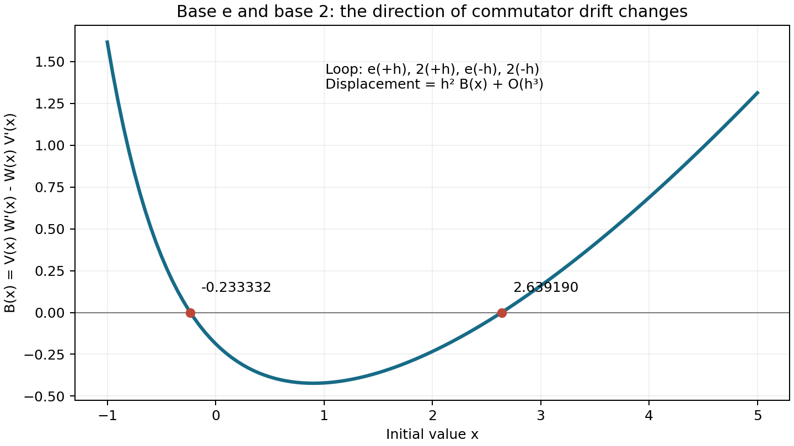

# 从函数开方到混合底数的无穷维李代数

本轮从“把运算当成数来操作”继续推进：不只研究一条指数迭代流，而是把
底数 e 与底数 2 的流放在一起。得到一项解析推论、两个数值零点和一个
可复现实验。这里不声称这些结果在文献中首次出现；本轮的新意指相对于
本仓库已有的实验内容。检索日期：2026-09-11。

## 1. 两种半步，顺序不同

记底数 b 的 Kneser 流为

\[
E_t^{(b)}(x)=S_b(A_b(x)+t),\qquad E_1^{(b)}(x)=b^x.
\]

沿用仓库的实分支，要求每一步的 Abel 坐标加时间大于 -2。
负时间只在相应定义域内使用；这些不是全实轴上的全局可逆群作用。

同一底数可以合并时间，但不同底数一般不能交换。半步实验从 x=1 出发：

| 按时间顺序执行 | 结果 |
|---|---:|
| e 的半步，再做 2 的半步 | 2.24551879372806662346675044892 |
| 2 的半步，再做 e 的半步 | 2.37755284138342398163475780277 |

两者相差 -0.132034047655357358168007353856。
整数步的不交换更直接：从 0 出发，先 exp 再 2 的指数得到 2，反过来得到 e。

这使“操作的顺序”成为新的研究变量。

## 2. 用一个小回路测量顺序差

令 F_t=E_t^(e)、G_t=E_t^(2)，按顺序做

\[
F_h,\quad G_h,\quad F_{-h},\quad G_{-h}.
\]

最终映射为

\[
C_h=G_{-h}\circ F_{-h}\circ G_h\circ F_h.
\]

设两个速度场为 V(x)=∂_t F_t(x)|₀、W(x)=∂_t G_t(x)|₀，
相应向量场为 X=V∂ₓ、Y=W∂ₓ。标准李括号公式给出

\[
C_h(x)=x+h^2B(x)+O(h^3),\qquad
B=VW'-WV',\qquad [X,Y]=B\partial_x.
\]

这属于已有的流交换子理论，见
[Mauhart–Michor, Commutators of flows and fields (1992)](https://arxiv.org/abs/math/9204221)。
本文固定上述回路方向；倒转约定会改变符号。

计算采用 S_b 的解析一、二阶导数和微分后的移位关系，得到

\[
V_b(x)=S_b'(A_b(x)),\qquad
V_b'(x)=\frac{S_b''(A_b(x))}{S_b'(A_b(x))}.
\]

随后用独立的四步函数复合校验这个预测。在 x=1，
B(1)≈-0.421003725476253073636769030028。
对称估计 `(C_h(x)+C_-h(x)-2x)/(2h²)` 的误差为：

| h | 与 B(1) 的绝对差 |
|---|---:|
| 0.01 | 3.7387452e-5 |
| 0.005 | 9.3466901e-6 |
| 0.0025 | 2.3366617e-6 |
| 0.00125 | 5.8416475e-7 |

步长减半，误差约缩小四倍，符合消去奇数阶项后的二阶收敛。

## 3. 两个零点不等于可交换

在 [-4,12] 上以 0.05 为步长扫描 321 点，发现两个符号变化区间，细化得到：

\[
r_-\approx-0.233331621448155989804909993217,
\qquad
r_+\approx2.63918993671377868888020006942.
\]

40 位与 55 位工作精度给出的上述显示数字一致，但两次使用同一套约 50 位
系数。这是工作精度稳定性检查，不是独立构建验证，也不是认证误差界。
根残差低于 1e-55 只表示数值求解器把近似方程解得很精确。



上述网格上，符号顺序为正、负、正。有限网格不能排除遗漏的根、偶重根或
区间外的根。尤其不能据此断言“全实轴恰有两个根”。

把回路展开到三阶可得

\[
C_h(x)=x+h^2B(x)+\frac{h^3}{2}
\big((V+W)B'-(V'+W')B\big)(x)+O(h^4).
\]

所以在 B(r)=0 处，仍可能有

\[
C_h(r)-r=\tfrac12(V(r)+W(r))B'(r)h^3+O(h^4).
\]

两个根处三阶系数的预测分别约为 -1.37289613685 与 0.956674476669。
实际取 h=1e-5，测得 `(C_h(r)-r)/h³` 分别为
-1.37288437886 与 0.956672066613，并随 h 减小趋向预测。

因此这里消失的是二阶漂移；有限步回路仍然留下三阶漂移。

## 4. 解析推论：两种底数生成无穷维李代数

这部分不依赖上面的零点扫描。

**命题。** 取两个不同底数 b,c>e^(1/e)，假定采用标准 Kneser 流及其正的
实解析生成元。那么它们生成的实李代数是无穷维的。特别适用于本仓库的
b=e、c=2。

这里“维数”是向量场作为函数对象在常数域 R 上的线性维数；底层空间仍然是
一维实轴。不是说一个点上出现了无穷多个独立的空间方向。

**证明。** 设 a=log b>0、d=log c>0，且 a≠d。由流与其时间一映射交换，
对时间求导得到 Julia 方程

\[
V_b(e^{ax})=a e^{ax}V_b(x).
\]

由于 V_b 在 0 附近解析且 V_b(0)>0，令 x→-∞，得到

\[
V_b(x)=\frac{V_b(e^{ax})}{a e^{ax}}
=p e^{-ax}+O(1),\qquad p=V_b(0)/a>0.
\]

同理 V_c(x)=q e^{-dx}+O(1)，q=V_c(0)/d>0。
这些不仅是函数渐近式：右侧可在 e^(ax)、e^(dx) 中展开成收敛级数，
所以任意固定阶的导数都有对应渐近展开。以下求导因此有依据。

写 X=V_b∂ₓ、Y=V_c∂ₓ，并递归定义

\[
Z_0=Y,\qquad Z_{n+1}=[X,Z_n].
\]

若 Z_n=z_n∂ₓ，则 z_(n+1)=V_b z_n'-z_n V_b'。逐次代入得到

\[
z_n(x)\sim q p^n
\left[\prod_{j=0}^{n-1}\big((1-j)a-d\big)\right]
e^{-(d+na)x}\qquad(x\to-\infty).
\]

空乘积取 1。递推中余项相对于主项至少小 O(e^(min(a,d)x))，且可对固定阶
求导；也可直接由上述收敛指数级数的有限次乘法、求导得到这一点。

首个因子 a-d≠0，其余因子（j≥1）均严格为负，所以所有主项系数非零。
增长指数 d,d+a,d+2a,… 严格递增。若存在有限非平凡常系数线性关系，
取最大指标 N，除以 e^(-(d+Na)x)，令 x→-∞，就只剩第 N 项的非零常数，
矛盾。因此 Z_0,Z_1,… 线性独立。证毕。

**这条推论推进了什么？** 单条流的迭代次数只有一个参数；加入另一底数后，
闭合于李括号的最小实向量空间已经是无穷维的。无法用有限多个固定向量场，
通过常系数线性组合，容纳所有这些反复产生的括号。

它不证明生成了所有解析向量场，不给出某个全局无限维李群，也没有定义
Goodstein 意义的五级运算。无穷维性和整个代数的分类是不同问题。

### e 与 2 的低阶校验

这时 a=1、d=log 2。前三个增长指数为
1+log 2、2+log 2、3+log 2。对应主项系数约为

\[
0.620139380194743,\quad-0.469293862761881,\quad0.867500411133403.
\]

在 x=-20，把计算值除以解析主项，分别得到

\[
0.99999789555,\quad0.99999999614,\quad0.99999999664.
\]

后两阶用了步长 1e-6 的中心差分。这是低阶校验，精度同时受差分误差限制；
上面的无穷维证明不依赖它，也不依赖把有限阶实验推广到无穷阶。

## 5. 接下来真正未解决的问题

1. B 在整个实轴上是否恰有两个零点？首先需要认证区间估计，以及左右尾部
   的符号控制。当前只证明左尾为正；由 `W(1)/V(1)=log(2) W(0)/V(0)`，
   还可知 `(0,1)` 内某处 B<0，因而至少存在一个零点，但这不证明两个。
2. 换成任意不同底数 b,c>e^(1/e)，零点数量是否改变？解析无穷维推论对它们
   已成立，但零点结构可能依赖参数。
3. 两个生成元之间除了李括号的通用恒等式，还有哪些额外关系？上面的证明
   只给出一列独立元素，不说明这个李代数是否自由、是否稠密于某个函数空间。
4. 重复小回路能否稳定数值实现 B∂ₓ 的流？标准局部交换子近似给出路线，
   但 Kneser 负时间的定义域、累计误差和大步行为需要分别验证。

这些是本报告留待研究的问题，不是经过穷尽文献检索的“全球开放问题”声明。

## 6. 文件、复现与依据

- [实验代码](demo_mixed_base_bracket.py)：只使用已有 e/2 系数，不触发新底数构建。
- [完整数值结果](mixed-base-bracket-results.json)：网格、夹根区间、收敛表及尾部数据。
- [验证代码](../tests/test_mixed_base_bracket.py)：四步复合与导数公式交叉校验，
  零点处三阶漂移，以及低阶括号的左尾渐近。

从 kneser/ 运行：

```sh
PYTHONPATH=src python3 docs/demo_mixed_base_bracket.py --output docs/mixed-base-bracket-results.json --plot docs/mixed-base-bracket.png
PYTHONPATH=src python3 docs/demo_mixed_base_bracket.py --dps 40
PYTHONPATH=src python3 -m pytest tests/test_mixed_base_bracket.py -q
```

绘图需要 matplotlib，纯数值实验只需要本库和 mpmath。
工作精度 55 位不意味着系数超过 50 位，也不意味着图或测试构成严格区间认证。

标准理论依据：

- [Paulsen–Cowgill (2017), Solving F(z+1)=b^F(z) in the complex plane](https://arch.astate.edu/scm-mathfac/9/)：
  b>e^(1/e) 的 Kneser 型超指数、选择条件与数值方法。
- [Mauhart–Michor (1992), Commutators of flows and fields](https://arxiv.org/abs/math/9204221)：
  流交换子与李括号。本文在这些已有对象上给出左尾渐近推导和具体实验，
  并不把通用李括号公式当作新发现。
