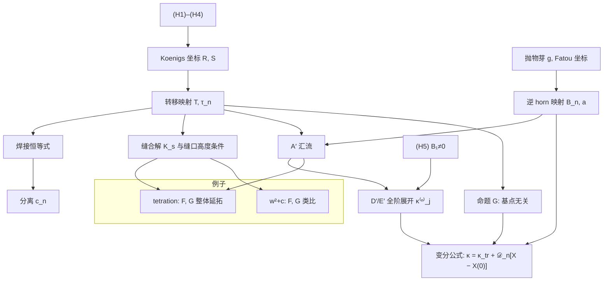

# 实鞍结开折的分数迭代：双坐标理论（核心）

2026-10-07。本文取代 [theory-framework-zh.md](theory-framework-zh.md) 成为理论的入口。
旧文的内容全部保留，但重新排了主次：**主角是一般的实鞍结开折，tetration 是第一个例子**；
层数轴和高度轴降为「应用与开放问题」。整理的理由见 [beauty-plan-zh.md](beauty-plan-zh.md)。

状态标记：**[证]** 纸面证明，**[证·机]** 区间算术证书，**[推]** 不严格的推导，**[数]** 数值证据，**[猜]** 猜想，**[否]** 已证伪。

---

## 0. 一句话与主定理

> **一个映射的分数次迭代不是一个函数，而是一种缝合两个不动点坐标的方式。**
> 所有缝法之间的差别，都记录在两个坐标的转移映射里。
> 当两个不动点在鞍结中合并时，这个转移映射收敛到抛物芽的逆 horn 映射。
> 它偏离极限的一阶项，是 horn 不变量沿开折方向的导数：切向部分是 horn 映射的导数，法向部分是芽的一个常数。

**主定理.** 设 `f_s = g − sX + O(s²)` 是满足 (H1)–(H4) 的实鞍结开折（§1），`s ↓ 0`。则对每个 `n ≥ 1`：

```
(i)   缝合：存在唯一满足缝口高度条件的分数迭代 K_s，其分离系数满足 c_n / Λⁿ = τ_n + O(Λ)；
(ii)  汇流：τ_n → B_n e^{2πina}；
(iii) 展开：log( τ_n / B_n e^{2πina} ) ~ Σ_{j≥1} κ⁽ⁿ⁾_j p^j，其中 p = −log λ₁ · log λ₂；
(iv)  变分：κ⁽ⁿ⁾_1 = κ⁽ⁿ⁾_tr(g) + 𝒟_n(g)[X − X(0)] / (4a₂X(0))，𝒟_n = d log(B_n e^{2πina}) 沿抛物层；
(v)   不变性：|τ_n| 与 Re κ⁽ⁿ⁾_j 不依赖基点，是开折在局部实解析共轭下的不变量。
```

（ii）以后的对数陈述要求 `B_n ≠ 0`，即 (H5)。状态：(i)–(v) 均为 **[证]**；(iv) 另有 **[数]** 印证到 1e−17。
出处：(i) 定理 B′、C′；(ii) 定理 A′；(iii) 定理 D′、E′；(v) 命题 G，均见 [general-statements-zh.md](general-statements-zh.md)；
(iv) 见 [kappa-variation-zh.md](kappa-variation-zh.md) 与论文 Theorem `thm:gen-variation`。

主定理逐条对应的不变量层次：

| 阶 | 不变量 | 依赖于 | 意义 |
|---|---|---|---|
| 0 | `\|B_n\|` | 芽 `g` | Écalle–Voronin 模的模长 |
| 0 | `B_n e^{2πina}` | 芽 + 基点 | 汇流极限 |
| 1 | `Re κ⁽ⁿ⁾` | 开折方向 `X` 在 `coker L` 中的类 | 法向导数 `κ_tr` + horn 映射的切向导数 |
| j | `Re κ⁽ⁿ⁾_j` | 开折 | 由同类收敛级数构造 |

---

## 1. 设定与记号

### 1.1 假设

`f_s(w)` 是实单参数族，在鞍结点 `(s, w) = (0, w*)` 附近满足：

| 编号 | 假设 |
|---|---|
| (H1) | `f_s(w)` 对 `w` 整，对 `s` 全纯，实对实 |
| (H2) | 鞍结：`f_0(w*) = w*`，`f_0′(w*) = 1`，`a₂ > 0` |
| (H3) | 横截：`γ := X(0) > 0`，其中 `X := −∂_s f_s|_{s=0}`（在 `u = w − w*` 坐标下） |
| (H4) | 基点 `w₀ < w*` 在 `f_0` 的直接吸引花瓣里 |
| (H5) | （仅对数陈述）`B_n ≠ 0` |

`s > 0` 时有两个实不动点：吸引的 `u₁ < 0` 和排斥的 `u₂ > 0`。

### 1.2 记号表（一字一义）

本表与投稿论文 [paper-submission/main.tex](paper-submission/main.tex) 的 Notation 一节一致（2026-10-07 起）。

| 记号 | 含义 | 旧文中的写法 |
|---|---|---|
| `s` | 开折参数，`s > 0` 为两实不动点一侧 | `s`、`1 − e log b`、`μ₀ − μ` |
| `ε` | `1 − λ₁`（tetration 尖点附近为复参数） | 同（旧稿 W2–char 节曾用它表示 `\|log λ\|`） |
| `g` | 抛物芽 `f_0(w* + u) − w* = u + a₂u² + a₃u³ + …` | `g` |
| `a₂, a₃` | 芽的 Taylor 系数 | 同 |
| `ρ` | 迭代留数 `1 − a₃/a₂²` | 同；tetration 为 1/3 |
| `X` | 开折方向 `−∂_s f_s|₀` | （新） |
| `γ` | 横截性 `X(0)` | 同 |
| `L` | 同调算子 `Lφ = φ∘g − g′φ` | （新） |
| `λ₁, λ₂` | 吸引、排斥乘子 | `λ, λ₂`（tetration 中 `λ` 还表示不动点的对数） |
| `p` | 内蕴参数 `−log λ₁ · log λ₂ = 4a₂γ s + O(s²)` | 同 |
| `h` | 吸引坐标的虚周期 `2π/\|log λ₁\|` | 同（旧稿中 `h^{±1}` 还表示 horn 映射） |
| `Λ` | 强迫尺度 `exp(4π²/log λ₁) = e^{−2πh}` | 同 |
| `R, S` | 吸引、排斥 Koenigs 坐标（`R⁻¹(w₀) = 0`） | 同 |
| `T` | 转移映射 `R⁻¹∘S`，`T(z) − z = Σ t_n e^{2πinz}` | 同 |
| `τ_n` | 规范化转移系数 `t_n e^{−2πint₀}` | 同（旧文中 `τ` 还表示排斥 Koenigs 映射和 `T − id − t₀`） |
| `K_s` | 缝合解（分数迭代） | `K^W_b` |
| `c_n` | 分离系数：`K = R∘(id + Σ c_n e^{2πinz})` | 同 |
| `Ξ_n` | 规范无关比值 `c_n/c₁ⁿ` | `κ_n` |
| `Φ_att, Φ_rep` | 抛物芽的 Fatou 坐标，用形式 Abel 函数 `α = −1/(a₂u) + ρ log(−u) + …` 归一化 | 同 |
| `𝔥⁻¹` | 逆上 horn 映射 `Φ_att∘Φ_rep⁻¹ = z + Σ B_n e^{2πinz}` | `h⁻¹` |
| `a` | 基点的 Fatou 值 `Φ_att(u*)`，`u* = w₀ − w*` | `a` |
| `κ⁽ⁿ⁾_j` | 展开系数；`κ⁽ⁿ⁾ := κ⁽ⁿ⁾_1` | 同（旧文中 `κ` 还表示 Kneser 坐标 `κ_b` 和比值 `κ_n`） |
| `κ⁽ⁿ⁾_tr(g)` | 法向导数 `κ⁽ⁿ⁾[g; 1]`（平移开折 `g − s` 的一阶项） | （新） |
| `𝒫` | 抛物层：有二重不动点的映射，`T_g𝒫 = {Y : Y(0) = 0}` | （新） |
| `𝒟_n(g)` | horn 不变量沿 `𝒫` 的微分 `d log(B_n e^{2πina})|_𝒫` | （新） |
| `ℓ` | 超运算的层数（§6） | `s` |
| `𝒦_b` | tetration 的 Kneser 坐标（§5） | `κ_b` |

---

## 2. 双坐标与转移映射

**转移映射 [证].** `T = R⁻¹∘S` 是 1-周期的。它只依赖于映射，不依赖于选哪个分数迭代。
`S` 的平移不改变 `τ_n`；`R` 的归一化（基点）只让 `τ_n` 乘上 `e^{2πinΔ}`，其中 `Δ` 是实数（命题 G）。

**分离 [证].** 任何上方有 `R` 表示、下方有 `S` 表示的分数迭代都可以写成 `K = R∘(id + P)`，`P(z) = Σ c_n e^{2πinz}`。

**焊接恒等式 [证].** `t_n = Σ_{m≥n} c_m [e^{2πimG}]_{n−m}`。所以分离系数是转移映射的函数：
分离是映射的不变量，不是构造方法的产物。

**缝合与刻画 [证]（B′、C′）.** 沿 `T − ih` 把 `R` 的上半柱面和 `S` 的下半柱面共形缝合，得到 `K_s`。
它在「下方表示的虚部在 `h/2` 附近」（缝口高度条件）的类中唯一，并且 `|c_n/Λⁿ − τ_n| ≤ C_n Λ`。
缝口高度条件是一个**选根条件**：缝口在实轴下方半个周期处，这由 (H4) 推出，对所有族都成立 [数]。

---

## 3. 汇流与一阶项

**尺度 [证].** `|log λ_{1,2}| = 2√(a₂γs)(1 + O(√s))`，`Λ = exp(−2π²/√(a₂γs)·(1 + o(1)))`。

**汇流 A′ [证].** `τ_n → B_n e^{2πina}`。极限是**逆** horn 映射，不是 horn 映射本身。
这是鞍结开折在 Glutsyuk 方向（两个不动点都是实的）的汇流命题；它的互补方向（Lavaurs 方向）是经典的抛物内爆。

**全阶展开 D′、E′ [证].** `log(τ_n / B_n e^{2πina})` 对 `p` 有渐近展开。各阶系数由一致模型时间
`A₁ log(u − u₁) + A₂ log(u − u₂) + P_s(u)` 正则化后的绝对收敛轨道级数给出。逐项求导的级数发散，这正是需要一致模型的原因。

**变分公式 [证]（新；论文 Theorem `thm:gen-variation`）.**

```
κ⁽ⁿ⁾[g; X] = κ⁽ⁿ⁾_tr(g) + 𝒟_n(g)[X − X(0)] / (4a₂X(0))。
```

- **几何含义**：`log τ_n` 作为两实不动点映射上的函数，一阶光滑地延拓到抛物层 `𝒫`（有二重不动点的映射），
  在 `𝒫` 上等于 `log(B_n e^{2πina})`。`T_g𝒫 = {Y : Y(0) = 0}`，所以 `X − X(0)` 是切向分量，常数 `1` 是法向。
  切向导数 `𝒟_n` 是 horn 映射的导数；法向导数 `κ⁽ⁿ⁾_tr(g)` 是平移开折 `g − s` 的一阶项。
- `Re 𝒟_n` 在无穷小共轭 `Lφ = φ∘g − g′φ` 上为零，所以 `Re κ` 只依赖开折方向在 `coker L` 中的类。
- `coker L` 的形式部分是 `span{1, u³}`，正好对应形式不变量（开折参数和 `ρ`）；其余是 Écalle–Voronin 模的切空间。

推论：

1. **`κ⁽ⁿ⁾` 没有只用芽数据写出的闭式。** 同一个芽、不同的开折方向，会给出不同的 `Re κ`（指数芽上从 −0.0102 到 395）[数]。
2. **tetration 的底数方向与平移开折同调。** `X − 1 = L(−2 − u)`，所以论文里的 `Re κ⁽ⁿ⁾` 就是 `Re κ⁽ⁿ⁾_tr(eᵘ − 1)`。

**不变性 G [证].** `|τ_n|`、`|c_n|` 和 `Re κ⁽ⁿ⁾_j` 都不依赖基点，是开折在局部实解析共轭下的不变量。
quad 和 sine 的芽形式共轭（`ρ = 1`），但 `|B₁|` 不同（0.0598 对 0.0724）。这与 Écalle–Voronin 一致。

---

## 4. 唯一依赖于族的输入：`B₁ ≠ 0`

只有在 (H5) 下，比值 `t_n/t₁ⁿ` 和对数形式的展开才有意义。它可以对「直接吸引域里只有一个奇异值」的族证明（Chéritat 的单奇值类）：
指数族和二次族 **[证]**，sine **[推]**，expq **[数]**。见 [general-statements-zh.md](general-statements-zh.md) §3。

---

## 5. 例子

| 族 | 芽 | `a₂` | `ρ` | `\|B₁\|` | `Re κ⁽¹⁾_tr` | 整体延拓（F、G） |
|---|---|---|---|---|---|---|
| tetration `b^w` | `eᵘ − 1` | 1/2 | 1/3 | 0.0890584364122133 [证·机] | −0.0101990063458974 | **[证]/[证·机]** |
| `w² + c` | `u + u²` | 1 | 1 | 0.059794236168968 | −0.0150441028391897 | **[证]/[证·机]**（专门论证） |
| `v − sin v + c` | `u + u²/2 − u⁴/24 + …` | 1/2 | 1 | 0.072378641624503 | — | 未检验 |
| `w + (w² − ε)eʷ` | `u + u²eᵘ` | 1 | 0 | 2744.09 | — | 未检验 |

### 5.1 tetration：第一个例子，也是唯一做完整体延拓的例子

`a₂ = 1/2`、`γ = 1`、`ρ = 1/3`，`s = 1 − e log b`，`p = 2s + (10/9)s² + …`，鞍结常数 `C = 4π²/√(2e^{1−1/e})`。
`a = 3.0292972144180…`（`u* = 1/e − 1`）[证·机]。

整体结果是这个例子特有的，因为它们依赖指数函数的整体几何（Shell–Thron 区的形状、`b = 0, 1` 两个奇点）：

| 结果 | 内容 | 状态 |
|---|---|---|
| 定理 F | Kneser 解绕过尖点 `η = e^{1/e}`，跨过边界弧，边界值等于 `K_s` | [证] |
| 定理 G | 上半 `b` 平面单值全纯，与 Paulsen 2019 的族相同 | [证·机] |
| 端点与实轴 | `e^{−e}`、`(0, η) \ {1}` 处可穿越；`b = 0, 1` 不可去 | [证]+[证·机] |
| θ 算子 | 不动点就是经典 Kneser 解（误差 < 2.878e−30） | [证·机] |
| 对文献的修正 | Paulsen 2019 Prop. 2 按原陈述对每个实 `b > η` 不成立；复底数需要选根条件 | [证] |

两种穿越技术（倾斜初始区域、直弦加标记点）是方法论资产，细节见 [theory-framework-zh.md](theory-framework-zh.md) §4.3。

### 5.2 二次族

F、G 的类比已有独立证明：参数芽在整个上半 `c` 平面单值全纯，并在实 `0 < c < 1/4` 处认同缝合分支。
这是二次族专门的论证（倾斜轨道标记、主心形区的显式输运、4,013 盒 Arb 覆盖），**不**推出一般开折的 F、G。
见 [quad-kneser-zh.md](quad-kneser-zh.md) §5.5。

---

## 6. 应用与开放问题（不属于理论本体）

下面两个方向与核心之间**没有定理联系**，只有类比。它们放在这里，是因为它们提出的问题可以用核心的语言来问。

### 6.1 层数方向（超运算 `S_ℓ(z+1) = S_{ℓ−1}(S_ℓ(z))`）

- **类比**：每一层 `ℓ ≥ 5` 都同时有正则构造和 Kneser 型构造，重演了 §2 的双坐标。五级的差 `D(1/2) = 2.9117e−5` [数]。
- **类比失效的信号**：预言 `D ~ Λ` 差了 4.7 个数量级 [否]。尺度律不能照搬到高层。
- **自身的结果**：每层的临界底数 `b_c(ℓ)` 单调且不超过 2 [证]；`b_∞` 不普适 [数]；
  层数趋于无穷时的热带极限 `min(1+z, b)` [推+数]。
- **要变成理论的一部分，缺的是**：一条把第 `ℓ` 层的分离和第 `ℓ − 1` 层的转移不变量联系起来的定理。

详见 [hyperoperation-program-zh.md](hyperoperation-program-zh.md)、[rank-tropical-limit-zh.md](rank-tropical-limit-zh.md)。

### 6.2 高度方向（「分数次」指哪个解）

- 缝口高度条件在核心理论里确定了 `K_s`。它就是这个方向目前唯一的正面结果。
- 负面结果：Bohr–Mollerup 型刻画不可能 [证]；Hardy 域刻画不唯一 [证]；只用 `±i∞` 处的极限不够 [证]。
- 流的生成元 `V`：凸性等价于 `sexp′` 对数凸 [证·机]；不同底数的生成元生成无穷维实李代数 [证]。
- **要变成理论的一部分，缺的是**：一个在实轴上刻画 Kneser 解的正面定理（旧 Q8）。

---

## 7. 开放问题（重新编号）

| 编号 | 问题 | 旧编号 |
|---|---|---|
| **C1** | 原问题「`κ⁽ⁿ⁾_tr(g)` 是否有闭式」**不是良定的**：`κ_tr` 依赖横截方向 `1` 的选取，在坐标变换下按上闭链变化（论文 Remark `rem:gen-cocycle`），不是芽的不变量。良定的问题是：仿射泛函 `X ↦ Re κ[X]` 在开折模空间（Christopher–Rousseau 标准形）里的内蕴描述 | Q3、Q11 |
| ~~C2~~ | ~~变分公式的完整证明~~。**已解决**：改用抛物层上的导数论证，不需要关于芽参数的一致性（论文 Theorem `thm:gen-variation`） | 新 |
| **C3** | 定理 F、G 对一般开折的移植；在什么全局条件下成立 | Q10 剩余部分 |
| **C4** | `p` 展开的收敛半径与最优 Gevrey 阶 | Q3 后半 |
| **C5** | `B₁ ≠ 0` 对无穷型整函数（sine）的证明 | 新 |
| **T1** | tetration：`b → 0, 1` 时非整数高度的一致渐近 | Q1 |
| **T2** | tetration：Shell–Thron 区内 Kneser 型解的全局唯一性 | Q2 |
| **T3** | tetration：梯子数值的区间包络 | Q4 |
| **A1–A5** | 层数与高度方向：Q5（五级尺度律）、Q6（`b_∞`）、Q7（热带极限）、Q8（正面唯一性）、Q9（李代数） | Q5–Q9 |

---

## 8. 依赖图



---

## 9. 机器验证

Lean 4 工程 [lean/](../lean/) 对 tetration 的实际指数族形式化了 (i) 的缝合、(ii) 的汇流基线和 (iii) 的全阶展开（322 个模块，无 `sorry`、无自定义公理）。
可读的入口是 [lean/Kneser/Interface.lean](../lean/Kneser/Interface.lean)。
**尚未**形式化的部分：经典 Kneser 恒等式、完整复参数延拓、`B₁ ≠ 0` 的数值证书，以及 (iv) 变分公式。
