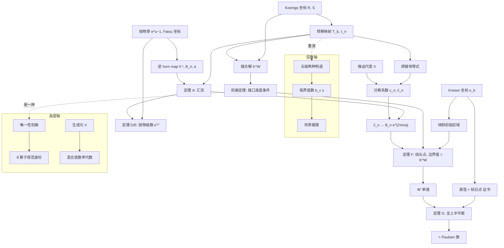

# 概念体系：迭代的双坐标理论（工作名）

> **2026-10-07 起，理论的入口改为 [theory-core-zh.md](theory-core-zh.md)。** 新文以一般实鞍结开折为主角、
> 统一了记号（本文 §11 列出的冲突已消除），并加入一阶项的变分公式（[kappa-variation-zh.md](kappa-variation-zh.md)）。
> 本文保留为详细的结果档案，内容不再更新，Q3、Q11 的状态除外。

2026-10-03。本文**不产生新结论**。它把仓库里分散在投稿论文、纲领文档和实验报告中的结果，
整理成一套有定义、有依赖关系、有状态标注的概念体系，作为后续写综述和做可推广性检验的底稿。

主要来源：

- 投稿版论文 [paper-submission/main.tex](paper-submission/main.tex)（下称「论文」），定理编号按它；
- 层数方向：[hyperoperation-program-zh.md](hyperoperation-program-zh.md)、[rank-tropical-limit-zh.md](rank-tropical-limit-zh.md)；
- 高度方向：[research-program-zh.md](research-program-zh.md)、[research-findings-zh.md](research-findings-zh.md)、
  [lemmas-round2-zh.md](lemmas-round2-zh.md)、[world-class-results-zh.md](world-class-results-zh.md)、
  [mixed-base-lie-algebra-zh.md](mixed-base-lie-algebra-zh.md)。

**状态标记**（全文统一）

| 标记 | 含义 |
|---|---|
| **[证]** | 有完整的纸面证明 |
| **[证·机]** | 计算机辅助证明（区间算术证书，未做证明助手形式化） |
| **[推]** | 有推导，但不严格（渐近匹配、启发式） |
| **[数]** | 只有数值证据 |
| **[猜]** | 明确列为猜想或开放问题 |
| **[否]** | 已被证伪或撤回。保留在体系里，因为它限定了概念的边界 |

---

## 0. 定位：这是什么，不是什么

**不是一门新学科。** 所用工具全部来自已有领域：

- 全纯动力系统：Koenigs/Fatou 坐标、抛物内爆、horn map（Écalle、Voronin、Lavaurs、Shishikura）；
- 鞍结开折的汇流理论：Glutsyuk 方向（Glutsyuk、Mardešić–Roussarie–Rousseau、Christopher–Rousseau）；
- 拟共形映射：Ahlfors–Bers 定理；
- 函数方程：Abel/Schröder 方程，Kneser 1950 的构造。

**是一个研究方向。** 它的中心命题是：

> 一个映射的「分数次迭代」并不是一个函数，而是**一种把不动点处的局部坐标缝合起来的方式**。
> 不同的缝法给出不同的分数次迭代；它们之间的差别，由坐标之间**转移映射的不变量**完全记录。
> 当参数（底数、层数）变化时，这些不变量的退化、延拓和极限，就是这个方向的研究对象。

tetration（`F(z+1) = b^{F(z)}`）是这套想法的第一个、也是目前唯一被做透的实例。
它能否成为一般理论，取决于 §7 列出的可推广性检验。

---

## 1. 三根参数轴

同一个函数方程族带有三个连续参数。本体系的组织方式，就是把每根轴上的问题放进同一个框架：

| 轴 | 记号 | 方程 | 主要问题 | 成熟度 |
|---|---|---|---|---|
| **基底轴** | `b ∈ ℂ` | `F_b(z+1) = b^{F_b(z)}` | 不同构造之间的分离；全纯延拓；奇点 | 论文主体，大部分 [证]/[证·机] |
| **层数轴** | `s = 4, 5, 6, …` | `S_s(z+1) = S_{s−1}(S_s(z))` | 每层都有两种构造；临界底数；层数 → ∞ 的极限 | 少数 [证]，主要是 [推]/[数] |
| **高度轴** | `t ∈ ℝ` 或 `ℂ` | `E_t = S ∘ (A + t)` | 唯一性刻画；流的生成元；不同底数的流之间的代数 | 正反结果都有，刻画问题仍开放 |

三根轴不是平行的：层数轴的每一层都重复一次基底轴的故事（§5.1），高度轴则决定「分数次」到底指哪一个解（§6）。

---

## 2. 基本对象（术语表）

### 2.1 基底平面的分区

| 名称 | 定义 | 角色 |
|---|---|---|
| `η` | `e^{1/e} = 1.44466786…` | 抛物点。`b → η` 时两个实不动点合并成一个乘子为 1 的不动点 |
| Kneser 区 | 实 `b > η` | 一对复共轭不动点 `L, L̄`；Kneser 解是标准解 |
| 正则区 | `1 < b < η` | 实不动点：吸引的 `L = e^λ`（`0<λ<1`）和排斥的 `L₂ = e^{λ₂}` |
| Shell–Thron 区 `𝒰` | 塔 `b^{b^{⋯}}` 收敛的复底数集合 | `𝒰⁺` 是它的上半部分；边界弧为 `β(α) = exp(e^{iα} e^{−e^{iα}})` |
| 尖点（cusp） | `b = η` 作为 `𝒰` 的边界点 | 「绕尖点」是论文定理 F 的几何内容 |
| 中性端点 | `b = e^{−e}` | 边界弧在 `α = π` 处的端点 |
| 真奇点 | `b = 0, 1` | 不可去（论文 Prop. zero-one-obstruction）[证] |

### 2.2 坐标（「解」的各种来源）

本体系的基本单位不是「解」，而是**坐标**：把映射 `w ↦ b^w` 在某处共轭成平移 `z ↦ z+1` 的局部图。

| 记号 | 名称 | 在哪里定义 | 构造方式 |
|---|---|---|---|
| `R_b` | 吸引正则坐标（Koenigs） | `1 < b < η`，吸引点 `L` | Schröder 函数取对数 |
| `S_b` | 排斥正则坐标 | `1 < b < η`，排斥点 `L₂` | 同上 |
| `κ_b` | Kneser 坐标 | 实 `b > η`，再沿 `b` 延拓 | 两个共轭不动点之间的弦及其像构成初始区域，然后做共形单值化 |
| `K^W_b` | 缝合解（sewing solution） | `b₁ < b < η` | 把 `R` 的上半柱面和 `S` 的下半柱面沿 `T_b` 共形缝合（论文定理 B） |
| `F^ℓ_ε` | 倾斜解（tilted solution） | 尖点附近的复 `b` | 把 Kneser 初始区域连续倾斜，绕过尖点（论文 Def. cusp-solution） |
| `F^tr` | 输运解 | 整个 `𝒰⁺` | 动力系统的拟共形输运（论文 §global） |
| `Φ_att, Φ_rep` | Fatou 坐标 | `b = η` 的抛物芽 `f(u) = e^u − 1` | 都用形式 Abel 函数 `α(u) = −2/u + ⅓ log(−u) + O(u)` 归一化 |

**归一化约定**：所有解都满足 `F(0) = 1`。

### 2.3 三个尺度

| 记号 | 定义 | 意义 |
|---|---|---|
| `h` | `2π/\|log λ\|` | `R_b` 的虚周期 |
| `Λ` | `e^{−2πh} = exp(4π²/log λ)` | 分离的**强迫尺度**：缝口在实轴下方半个周期处，承载正模的闸门又在缝口下方半个周期处，所以每个 Fourier 模都带一个因子 `Λ` |
| `C_η` | `4π²/√(2e^{1−1/e}) = 20.3508…` | 鞍结标度：`Λ = exp(−C_η (η−b)^{−1/2}(1+o(1)))` [证] |

---

## 3. 核心机制：双坐标与转移映射

这一节是整套体系的「公理层」。后面所有不变量都从这里定义。

### 3.1 转移映射 [证]

当两个坐标在一个公共区域上都有定义时，其中一个在另一个里的表示就是**转移映射**：

```
T_b = R_b⁻¹ ∘ S_b,       T_b(z) − z = Σ_n t_n e^{2πinz}
```

它是 1-周期的，只依赖于映射本身，与选择哪个「分数次迭代」无关。
规范化后的系数为 `τ_n = t_n e^{−2πin t₀}`（消掉平移规范）。
实结构由论文 Lemma realT 给出。

**这是本体系的第一个核心概念**：*分数次迭代的歧义，被压缩进两个经典坐标之间的一个周期函数。*

### 3.2 分离 [证]

任何同时具有 `R` 表示（上方）和 `S` 表示（下方）的解 `K`，都可以写成

```
K = R ∘ (id + P),     P(z) = Σ_{n≥0} c_n e^{2πinz}
K − R = c₁ R'(z)(e^{2πiz} − 1) + O(c₂) + O(c₁²)
```

`c_n` 称为**分离系数**，`ĉ_n = c_n/Λⁿ` 称为**规范化分离系数**。

### 3.3 焊接恒等式 [证]（论文定理 welding）

```
t_n = Σ_{m≥n} c_m [e^{2πimG}]_{n−m}
```

它把**解的分离系数** `c_n` 和**映射的转移系数** `t_n` 连起来。由此（论文 Cor. cn）得到：
分离是转移映射的不变量，而不是构造方法的产物。

### 3.4 缝合解及其刻画 [证]（论文定理 B、Def. class、定理 char）

缝合解 `K^W_b` 是 `R` 和 `S` 两个半柱面沿 `T_b` 的共形缝合，由加权 Wiener 代数里的压缩映射得到（论文定理 W2）。
它在类 `𝒞_b(Y)` 中**唯一**。这个类的条件是：

- (a) 上方有 `R ∘ (id + P)` 表示，`P` 有界、1-周期；
- (b) 下方有 `S ∘ (id + Q)` 表示，`Q` 有界，且 `|Im Q − h/2| ≤ 1`。

条件 (b) 即**缝口高度条件**：排斥时间的实线，位于吸引时间实轴下方半个周期处。
它是一种「选根条件」。没有它，平移 `K^W(· + c_j)` 会给出 `|c₁| ≍ Λ^{1+j}` 的伪解。

估计：`|ĉ_n − τ_n(b)| ≤ C_n Λ`，其中 `C_n` 不依赖 `b`。

### 3.5 不变量清单

| 不变量 | 定义 | 规范变换下 | 状态 |
|---|---|---|---|
| `\|ĉ₁\|` | `\|c₁\|/Λ` | 不变 | 数值上在 0.085–0.089 之间，横跨 45 个数量级的 `Λ` 都成立 [数]；极限值为 `\|B₁\|` [证] |
| `arg ĉ₁` | | **不是**不变量（随平移规范变化） | [证] |
| `κ_n` | `c_n / c₁ⁿ`（等价地 `t_n/t₁ⁿ`） | 不变 | 极限为 `B_n/B₁ⁿ` [证] |
| `τ_n` | `t_n e^{−2πin t₀}` | 不变 | 映射本身的不变量；`\|τ_n\|` 还与基点选择无关（[命题 G](general-statements-zh.md)，[证]） |

早期稿 [paper-separation/main.tex](paper-separation/main.tex) §onlytwo 讨论了平移规范与形式共轭：去掉规范自由度之后，**只剩下这些量**。

---

## 4. 基底轴

### 4.1 退化：汇流到抛物 horn map

`b → η⁻` 时，两个实不动点合并，映射退化为抛物芽 `f(u) = e^u − 1`（坐标 `w = e(1+u)`）。

| 对象 | 值 | 状态 |
|---|---|---|
| 逆 horn map | `Φ_att ∘ Φ_rep⁻¹(z) = z + Σ B_n e^{2πinz}` | 定义 |
| `\|B₁\|` | `0.0890584364122133…` | 区间包络 [证·机]（论文 Prop. horn-intervals） |
| `B₁ ≠ 0` | | [证]（论文 Prop. horn-nonzero） |
| `B₂/B₁²` | `−0.0253204931 + 1.5742190652 i` | 区间包络 [证·机] |
| `a = Φ_att(1/e − 1)` | `3.0292972144180…` | [证·机]（`certify_parabolic_a.py`） |
| 极限相位 | `arg B₁ + 2πa = 1.5865330757… (mod 2π)` | [证] |

**定理 A（汇流）[证]**：对每个 `n ≥ 1`，`τ_n(b) → B_n e^{2πina}`（`b → η⁻`）。
这是鞍结开折在 **Glutsyuk 方向**（两个不动点都是实的）上的汇流命题。
它的互补方向（Lavaurs 方向）是经典的抛物内爆。
证明的关键工具是模型时间 `A₁ log(u − u₁) + A₂ log(u − u₂)`，它的一步误差在两个不动点处都为零（论文 §proofC）。

**推论 [证]**：`ĉ_n → B_n e^{2πina}`，`|c₁|/Λ → |B₁|`，`c_n/c₁ⁿ → B_n/B₁ⁿ`。

> 概念要点：**极限对象是反向 horn map `h⁻¹`**，不是 horn map 本身。这一点曾经搞错过，记在 MEMORY 里。

### 4.2 一阶项：抛物级数 [证]（论文定理 D、E）

令 `s = 1 − e log b`，`p = |log λ| log λ₂ = 2s + O(s²)`，则

```
log( τ_n / (B_n e^{2πina}) ) = κ⁽ⁿ⁾ p + O(p²)
```

`κ⁽ⁿ⁾` 由抛物芽 `e^u − 1` 的轨道上一个**绝对收敛的级数**给出。各阶都有渐近展开 `Σ κ⁽ⁿ⁾_j p^j`，每个系数都由同类级数构造。
逐项求导行不通，这正是需要这套级数的原因（论文 §first，「Why termwise differentiation fails」）。

数值：`κ⁽¹⁾ = −0.010199006345897402441 − 0.013250956182506712250 i`，
与 `b < η` 一侧的拟合吻合 11 位 [数]；`κ⁽¹⁾_2` 吻合到第 6 位 [数]。

### 4.3 整体：基底延拓

| 结果 | 内容 | 状态 | 证书 |
|---|---|---|---|
| 定理 F / thm:cusp | Kneser 解经上半圆盘绕过尖点，跨过边界弧（不论中性乘子的算术性质如何），边界值等于 `K^W_b` | [证] | — |
| thm:global | 在整个 `𝒰⁺` 中沿任何路径单值 | [证] | — |
| thm:far | 远离尖点处跨过边界弧（`α ≤ 0.9353π`） | [证·机] | `certify_far_collar.py` |
| thm:last-arc | 补齐 `0.935π ≤ α < π`，整条开上边界弧都可穿越 | [证·机] | `certify_last_boundary_arc.py` |
| thm:upper / 定理 G | 整个上半 `b` 平面单值全纯，因此与 Paulsen 2019 的族相同 | [证·机] | `certify_upper_halfplane.py` |
| thm:endpoint | 在 `e^{−e}` 和实段 `[e^{−1.95·10⁶}, 0.7833]` 的邻域全纯 | [证·机] | `certify_endpoint.py` |
| thm:positive-real-axis | 跨过 `(0, η) \ {1}` 的每一点（`(0, e^{−e})` 段用实二周期参数化） | [证] + [证·机] | — |
| Prop. zero-one-obstruction | `b = 0, 1` 不可去 | [证] | — |

两种穿越技术是本方向的**方法论资产**：

1. **倾斜初始区域**：在坐标 `log((u − u₁)/(u − u₂))` 中，初始区域是一条细带，映射在相对误差 `O(|ε|)` 内是平移，所以商空间一致拟共形于平坦柱面。中性边界因此不构成障碍。再用 Ahlfors–Bers 定理得到全纯依赖。
2. **直弦加标记点**：远离尖点时，Kneser 原本的直弦仍然围出一个月牙形，并带有一个典范标记点。这一点按「以延拓后不动点的乘子为参数」做区间算术验证。

### 4.4 对已有文献的修正 [证]

Paulsen 2019 Prop. 2（唯一性）**按原陈述对每个实 `b > η` 都不成立**：
平移 `F_k(z) = K(z + z_k + 2)` 给出无穷多个反例（论文 Remark paulsen）。
复底数需要补一个选根条件，缝口高度条件（§3.4）就是这样一个条件。
Paulsen–Cowgill 2017 不受影响，因为它额外要求了割线平面上的解析性和实对称性。

---

## 5. 层数轴

### 5.1 每一层都重演基底轴 [数]

四级以上的每一级运算，都同时存在两种构造：

- 实不动点处的 Koenigs/正则构造；
- 复共轭不动点对处的 Kneser/θ 构造。

这正是 §3 双坐标机制在层数轴上的重演。五级的差已经测到：

```
e↑↑↑½  正则解      = 1.63232474043606…
e↑↑↑½  Kneser 型解  = 1.63235385715702…
D(1/2) = 2.9117e-5     （两组独立参数吻合 6 位）
```

**[否]** 立项时的预言 `D ~ Λ` 差了 4.7 个数量级。现在的说法是「`Λ` 是比值，不是幅度」，证据只有两个底数，比较薄。
**这说明 §3 的尺度律不能照搬到高层**，是可推广性问题的第一个反例信号（§7）。

### 5.2 临界底数：每一层都有自己的 η

| 层 | `b_c(s)` | 状态 |
|---|---|---|
| 4 | `η = 1.44466786…` | 经典 |
| 5 | `1.63532449671528`（双重不动点：`sexp_b(x) = x` 且 `sexp_b'(x) = 1`） | [数]，且**唯一确定** |
| 6 | `1.73735592515169` | [数]，**依赖于选哪个五级运算** |
| 7 | `1.79912060` | [数]，同上 |
| 8 | `1.83976` | [数] |

- 单调性 `C_s ⊂ C_{s+1}`，上界 `b_c(s) ≤ 2`，对**任何**每层在 `[1, ∞)` 上递增的阶梯都成立 [证]。
- `b_∞` 不普适：不同种子的阶梯停在不同的值 [数]。普适的 `b_∞ = 2` 已撤回 [否]。

**概念要点：非唯一性会逐层传染。** 第 5 层的选择决定了第 6 层以上的临界底数。

### 5.3 层数 → ∞：热带化

`1 < b < η` 的正则阶梯（即 Nixon 的有界解析链）：

- 极限是折线 `S_s(z) → F_b(z) = min(1+z, b)` [推+数]；
- 有限层是它的 log-sum-exp 光滑化，温度为 `ħ_s = 1/L_s → 0`（Maslov 去量子化）[数+推]；
- 速率律：`s · λ_s^{b−1} → (2−b)/(b−1)` [推+数]；
- 转折点 `z = b−1` 处的缺口为 `g_s ~ (b−1) log 2 / log s`，是对数级的慢收敛 [推+数]；
- 「极限是 `F_b`」等价于一个数 `g_s → 0`。在凹性条件下 `F_b` 是最大的凹不动点 [证]；
- η 以上也收敛到同一个极限：**η 只是第 4 层的临界点，不是层数极限的临界点** [数]。

---

## 6. 高度轴：「分数次」到底指哪个解

这一轴的问题是**唯一性刻画**：用什么自然条件能把 Kneser 解从所有解里挑出来。目前的账本主要是负面结果，它们同样是体系的一部分。

| 候选刻画 | 结论 | 状态 |
|---|---|---|
| Bohr–Mollerup 型（共同右半直线上所有阶导数非负） | 规范化的实解析 tetration 不可能满足 | [证]，路线已关闭 |
| Hardy 域 | 在 `G' > 0` 的假设下任何光滑解都生成 Hardy 域；小正弦扰动给出非唯一性 | [证]，路线已关闭 |
| `±i∞` 处的极限 | 不足以确定解；需要额外的整数端标签 `m = 0` | [证]（论文 Remark paulsen） |
| 初始区域 / θ 算子 | 以 base `e` 为例，θ 算子的不动点被证明就是经典 Kneser 解，误差 `< 2.878e-30` | [证·机]（`theta-canonical-identity.md`） |
| 缝口高度条件 | 在 `(b₁, η)` 上确定缝合解 | [证]（§3.4） |

流的结构：

- 生成元 `V`：`half_exp` 等于自治方程 `x' = V(x)` 的 1/2 时刻映射；`V` 凸等价于 `sexp'` 对数凸 [证·机]；`V` 不可加 [证]。
- 不同底数的流不交换：取两个底数 `b ≠ c > η`，它们的标准 Kneser 生成元生成**无穷维实李代数** [证]；交换子的零点结构 [数/猜]。

---

## 7. 哪些概念是 tetration 专属的，哪些可能是一般的

这一节是第 2 步（可推广性检验）的输入。判断「这是一套理论还是一个特例」，就看这张表的右列能否成立。

| 概念 | 依赖了指数函数的什么 | 一般化的候选表述 | 预期 |
|---|---|---|---|
| 转移映射 `T`、焊接恒等式 | 只用了「两个双曲不动点 + 中间的基本域」 | 任何有吸引点和排斥点、且二者之间有不变实区间的单参数解析族 | 应当原样成立 |
| 缝合解与缝口高度条件 | 用了两个不动点之间实区间的存在 | 同上 | 应当成立；常数会变 |
| `Λ = exp(4π²/log λ)` | 只依赖吸引乘子 | 同上 | 应当成立 |
| 汇流到 `h⁻¹`（定理 A） | 一般的鞍结开折 | 任何以 `f(u) = u + u² + …` 为极限的实开折 | 应当成立；`B_n`、`a` 随芽而变 |
| 抛物级数 `κ⁽ⁿ⁾` | 芽 `e^u − 1` 的具体轨道 | 一般抛物芽 | 结构应当成立；收敛性需要逐个核验 |
| 绕尖点的倾斜区域 | 尖点处是二次切 | 同上 | 应当成立 |
| 全上半平面单值性（定理 G） | **大量使用指数函数的整体几何**（Shell–Thron 区的形状、`0` 和 `1` 两个奇点） | 不清楚 | **很可能是专属的** |
| 层数轴的临界底数 | 超运算阶梯的单调结构 | 一般的「迭代塔」 | 部分成立（单调性和上界的证明只用了单调性） |
| 热带极限 | 每层都是上一层的迭代 | 一般阶梯 | 不清楚 |

**判断标准**：如果第 3、4 节（转移映射、汇流、一阶项）能在一个非指数的族上原样走通，比如 `f_ε(u) = u + u² + ε` 的某个实化，或者 `w ↦ w e^{w} + c`，那么本方向就是一套**关于参数化分数迭代的理论**，tetration 只是其中第一个算例。
如果走不通，它就是关于 tetration 的一组深入结果。两种结局都可以发表，但写法完全不同。

**检验结果（2026-10-03，[generality-check-zh.md](generality-check-zh.md)）[数]**：在 `w² + c`、`v − sin v + c`、
`w + (w² − ε)eʷ`（ρ = 0、乘子不对称）三个族上，汇流（P1、P2）、一阶项（P3）、缝合 O(Λ)（P4）全部成立，
收敛速率与指数族相同；缝口高度 `Im t₀ = h/2` 也是普适的。新发现两点：

- 一阶常数的实部 Re κ⁽¹⁾ 与基点无关，是**开折**的不变量；虚部是基点规范。
- 采样闸门的位置因族而异，由全局动力学决定。这是本地与全局的分界线。

所以上表前五行可以视为普适（待证明审查），定理 F、G 未检验。

---

## 8. 概念依赖图



---

## 9. 定理与证书对照

| 论文定理 | 依赖的证书脚本 | 运行环境 |
|---|---|---|
| Prop. horn-intervals（`\|B₁\|` 等） | `certify_horn_coefficients.py` | python-flint/Arb |
| `a` 的包络 | `certify_parabolic_a.py` | 同上 |
| thm:far | `certify_far_collar.py` | 同上 |
| thm:last-arc | `certify_last_boundary_arc.py` | 同上 |
| thm:upper | `certify_upper_halfplane.py`（约 15 分钟） | 同上 |
| thm:endpoint | `certify_endpoint.py` | 同上 |
| θ 算子规范身份 | `certify_theta_*.py`、`certificates/*-e50` | galic，160 位 |

数值验证在 galic 上跑，不在本机跑。

---

## 10. 开放问题（编号供引用）

| 编号 | 问题 | 来源 |
|---|---|---|
| **Q1** | `b → 1` 和 `b → 0` 时非整数高度的一致渐近 | 论文 §open (1) |
| **Q2** | Shell–Thron 区内 Kneser 型解的全局唯一性定理（只用 `±i∞` 的极限不够） | 论文 §open (1) |
| **Q3** | `κ⁽ⁿ⁾` 是否有闭式（比如用 `B_n`、`a` 和迭代留数表示）；`p` 展开的收敛半径与最优 Gevrey 阶。**前半已否定回答**：变分公式表明 `κ⁽ⁿ⁾` 依赖开折方向，不是芽数据的函数；剩下的是普适常数 `K_n(g)` 的闭式（新编号 C1） | 论文 §open (2)；[kappa-variation-zh.md](kappa-variation-zh.md) |
| **Q4** | 给梯子计算值和外推的双不动点值配区间包络，把剩余的数值比较升级为 [证·机] | 论文 §open (3) |
| **Q5** | 五级运算的分离 `D` 遵循什么尺度律（`Λ` 预言已否） | §5.1 |
| **Q6** | `b_∞` 对解析阶梯的确切值，是否在 `[1.83976, 2]` 内 | §5.2 |
| **Q7** | 热带极限的严格证明，即 `g_s → 0` | §5.3 |
| **Q8** | 实轴上 tetration 的一个正面唯一性刻画（Bohr–Mollerup、Hardy 两条路已关） | §6 |
| **Q9** | 混合底数李代数是否自由，交换子零点是否恰有两个 | §6 |
| **Q10** | §7 的可推广性检验。数值上已成立（3 个新族）；证明审查已完成：定理 A、B、C、D、E 在假设 (H1)–(H5) 下对一般实鞍结开折成立，唯一依赖于族的输入是 `B₁ ≠ 0`。定理 F 在 quad 上数值成立（边界值 = K^W，含 O(Λ) 修正，[quad-kneser-zh.md](quad-kneser-zh.md)）；定理 G 只在尖点附近的楔形区域内得到数值支持（θ ≤ 0.4π 处全纯穿过心形区边界），其余区域构造不收敛；F、G 的证明没有移植。一般开折一节已写入论文（`paper-submission/sec-general.tex`） | [generality-check-zh.md](generality-check-zh.md)、[general-statements-zh.md](general-statements-zh.md)、[quad-kneser-zh.md](quad-kneser-zh.md) |
| **Q11** | Re κ⁽ⁿ⁾_j 的闭式，以及它与 Mardešić–Roussarie–Rousseau 开折模的关系。**已证明它与基点无关，是开折的解析不变量**（命题 G）。**2026-10-07 约化**：`Re κ⁽ⁿ⁾ = Re K_n(g) + ∂ log\|B_n\|/(4a₂γ)`，开折带来的一阶新信息只有芽的普适常数 `K_n(g)` [证·梗概]+[数] | [general-statements-zh.md](general-statements-zh.md) §2.7、[kappa-variation-zh.md](kappa-variation-zh.md) |

Q10 是决定本方向定位的那个问题。数值部分已完成，见 [generality-check-zh.md](generality-check-zh.md)。

---

## 11. 记号冲突（沿用论文的约定）

论文中有几个字母一字多用，在每一节内含义固定：

- `ε`：`1 − λ`，或尖点附近的复参数，或 `|log λ|`；三者一阶相同；
- `τ`：排斥 Koenigs 映射，或不变量 `τ_n`，或 `T − id − t₀`；
- `a`：Fatou 坐标 `Φ_att(1/e − 1)`；只在少数命题中表示 `log b`；
- `h`：周期 `2π/|log λ|`；horn map 记作 `h^{±1}`，只出现在特定章节；
- `κ`：基底延拓族 `κ_b`；带下标或上标时表示 `κ_n = c_n/c₁ⁿ` 和 `κ⁽ⁿ⁾`。

本文中「层数」统一指超运算的级别 `s`，「高度」统一指 `F(z)` 的自变量 `z`（即 `a↑↑z` 里的 `z`）。
